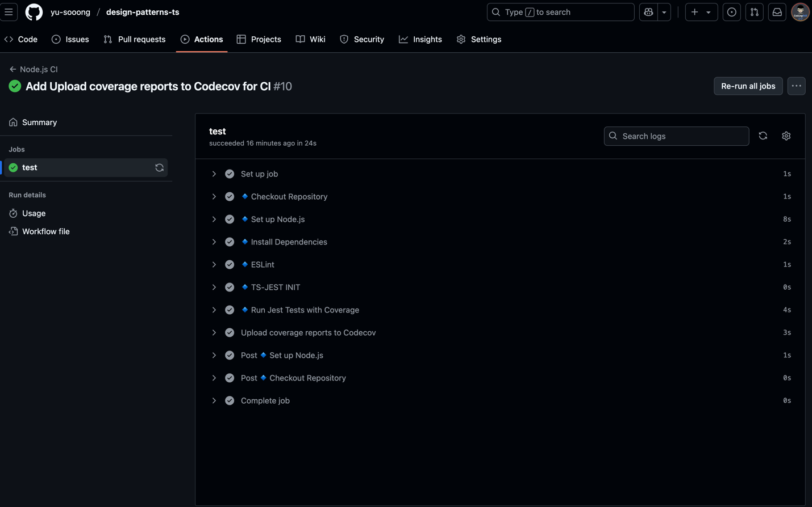
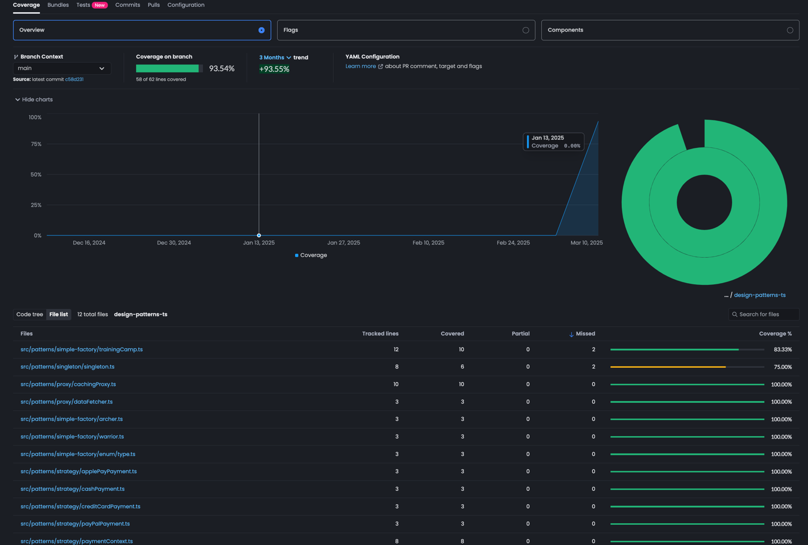

## 📌 **README.md - Design Patterns in TypeScript**

```md
# 🚀 Design Patterns in TypeScript

This project demonstrates key **design patterns** implemented in **TypeScript**, with **unit testing** using Jest, **CI/CD via GitHub Actions**, and **Code Coverage analysis via Codecov**.

## 🛠 Implemented Design Patterns:
✅ Singleton  
✅ Factory  
✅ Strategy  
✅ Proxy (Cache Implementation)

---

## 🏗 **Project Setup & Installation**
```sh
# Clone the repository
git clone https://github.com/your-username/design-patterns-ts.git
cd design-patterns-ts

# Install dependencies
npm install
```

---

## 🧪 **Running Tests & Code Coverage**
This project uses **Jest** for unit testing.  
To run tests and generate coverage reports:
```sh
npm test -- --coverage
```
After running tests, a **coverage report** will be generated in `coverage/`.

---

## 🛡 **ESLint Code Quality Check**
To ensure code follows best practices:
```sh
npm run lint
```
To **automatically fix** ESLint issues:
```sh
npm run lint:fix
```

---

## 🔄 **GitHub Actions - CI/CD**
This project uses **GitHub Actions** to run:
- 🔹 **ESLint** (Code Quality Check)
- 🔹 **Jest Unit Tests**
- 🔹 **Upload Code Coverage Reports to Codecov**

Every push to `main` automatically triggers these checks.



---

## 📊 **Code Coverage with Codecov**
[Codecov](https://about.codecov.io/) is used to track test coverage.

Codecov Coverage Report

To upload test coverage reports manually:
```sh
npm run test:coverage
npm run codecov
```

---

## ⚙ **Project Architecture**
The project follows a structured **MVC-inspired** pattern:
```
src/
│── patterns/
│   ├── singleton/
│   ├── factory/
│   ├── strategy/
│   ├── proxy/
│── tests/
│── .github/workflows/ci.yml
│── coverage/
│── package.json
│── jest.config.js
│── tsconfig.json
```
- **Patterns:** Contains the different design pattern implementations.
- **Tests:** Jest unit tests.
- **GitHub Actions Workflow (`ci.yml`)** handles CI/CD automation.
- **Coverage Reports (`coverage/`)** stores test coverage data.

---